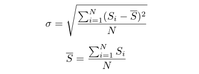
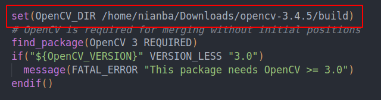
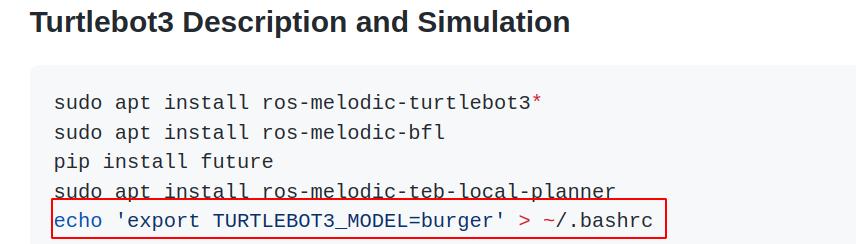
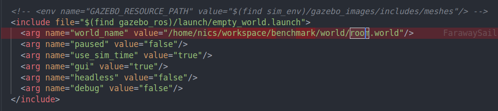
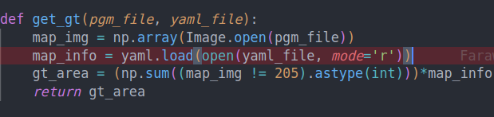
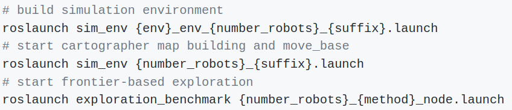
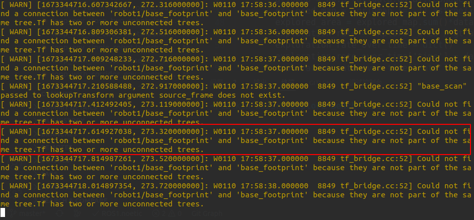
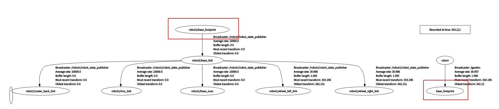

<Explore-Bench: Data Sets, Metrics and Evaluations for Frontier-based and Deep-reinforcement-learning-based Autonomous Exploration>

 https://github.com/efc-robot/Explore-Bench

# 一、论文内容：

1. Data Sets: Opposing to Gazebo, which provides dozens of scenarios manually, the proposed grid-based simulator can automatically generate thousands of scenarios.

2. Metrics:

   1. 效率评估

      • The total time T~total~ when the exploration ratio is 99%.
      • The time T~topo~ when the exploration ratio is 90%.

   2. 多机器人评估

      

3. PLATFORM

    Location Module: The ground truth pose originating from the Gazebo parameters is employed for accurate localization. Given that in real environments the ground-truth robot pose is unknown, we utilize the robot pose ekf [23] package to estimate its 3D pose.
   • Mapping Module: We adopt Cartographer [24] to per-form a laser-based SLAM to build a 2-D occupancy grid map. Our platform also supports other laser-based mapping algorithms, such as gmapping [25]. In multi-robot scenarios, we modify the multirobot map merge [26] package to merge the maps created from all robots by exploiting their relative positions.
   • Exploration Module: This module affords users to design their exploration algorithms and compare in our provided algorithm library. Each exploration method utilizes a unified 2D-map and the robots’ locations as input and outputs a goal (coordinates of a position) to navigate to. Hence, the proposed 3-level platform provides a unified interface for different exploration methods and different levels.
   • Motion Module: We adopt the move base [27] package for the path planning and collision avoidance.

   

# 二、问题

1. 依赖问题：比如opencv版本问题。catrtographer需要3.4.5或更低版本的opencv，而平台本身需要4.0以上的版本

   

​	解决方法：版本隔离

2. guide / 代码问题
   1. 
   2. 
   3. 

3. 运行问题：

   官方步骤

   

​		运行至第二步时出错：

​	依据错误提示，查看tf_tree

​						

不明白为什么它们之间需要连接？

正常slam运行

